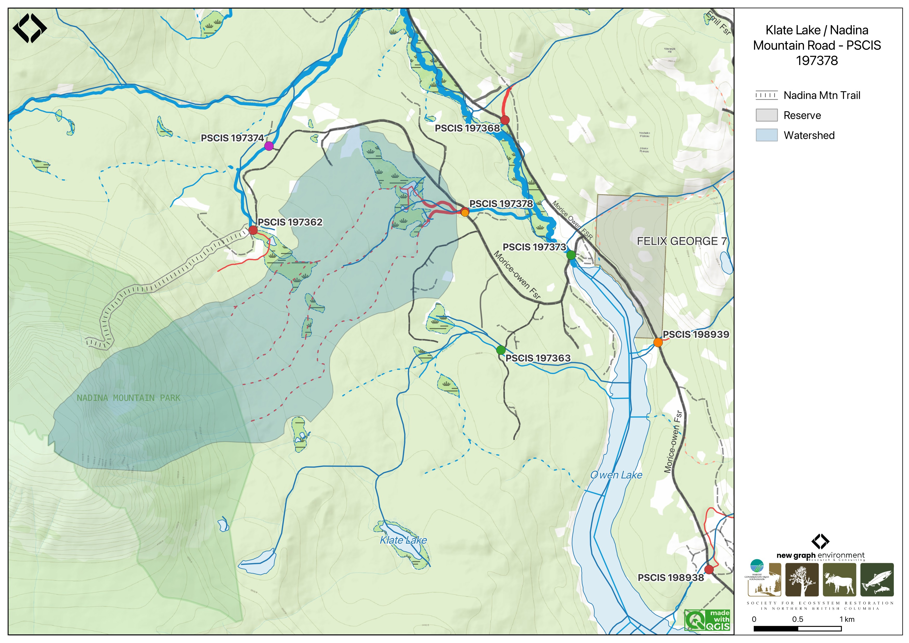

```{r setup-197378, eval = F}
knitr::opts_chunk$set(echo=FALSE, message=FALSE, warning=FALSE)
source('scripts/packages.R')
source('scripts/tables.R')

```

```{r  load-data-197378}
my_site <- 197378
```

`r fpr::fpr_appendix_title()`

## Site Location {.unnumbered}

PSCIS crossing `r as.character(my_site)` is located on
`r fpr::fpr_my_pscis_info()`, on `r fpr_my_pscis_info(col_pull = road_name)` road - approximately 1km upstream from the confluence with Owen Creek, which drains the nearby Owen Lake. Information sourced from the provincial [Forest Tenure Road Section Lines](https://catalogue.data.gov.bc.ca/dataset/forest-tenure-road-section-lines) spatial layer indicates
YLP Woodlands GP Ltd. is a road tenure holder at the crossing location [@moe2024ForestTenure]. YLP Woodlands GP Ltd. is
part of the Yinka Dene Economic Development Limited Partnership (YLP) which is the corporate business arm of the Wet’suwet’en First Nation.

<br>

## Background {.unnumbered}

PSCIS crossing `r as.character(my_site)` on `r fpr_my_pscis_info(col_pull = road_name)` road is located in the Bi Wini house territory, in the house of Keexwinits (House in the Middle of Many) that belongs to the Gitdumden (Bear/Wolf) clan within Wet’suwet’en territory [@bcparks2010NadinaMountain]. Felix George 7 First 
Nation Reserve lands are located on the east side of Owen Lake near the site. A provincial recreation site is also located near the site on the northern tip of Owen Lake 

<br>

This memo has been updated to reflect ongoing activities related to the restoration of fish passage at the site. 
The culvert on Klate Lake Road has been earmarked for replacement through the Bii Wenii Kwa Restoration/Recovery Plan which is 
a collaboration between the Wet'suwet'en Treaty Society, Fisheries and Oceans Canada, BC Ministry of Forests, and Water, 
Land and Resource Stewardship, Morice Water Monitoring Trust, and Northwest Research and Monitoring. The plan aims to 
improve watershed health and support both resident and anadromous fish while helping the Wet’suwet’en, and Federal and 
Provincial governments address habitat risks by enhancing and restoring fish habitat, consolidating existing data, 
prioritizing restoration work, and providing monitoring recommendations [@morgan2024biiwenii].

<br>

Klate Lake Road provides access to Nadina Mountain Park.  The park was established through a partnership between BC Parks 
and the Office of the Wet’suwet’en as part of the Morice Land and Resource Management Plan. It is one of seven protected 
areas resulting from government-to-government agreements. The park protects important cultural, spiritual, and ecological 
values, including habitat for mountain goats and rare plant communities. Recreational use is non-motorized and includes 
hiking, hunting, and wildlife viewing. Management priorities focus on conserving ecological integrity and Wet’suwet’en 
heritage while allowing low-impact education and recreation. Nadina means "standing up alone" in the Wet’suwet’en language 
[@bcparks2010NadinaMountain; @ilmb2007MoriceLand; @bcparks2025NadinaMountain].  

<br>

Klate Lake Road accesses a challenging trail that climbs the northeast slope of Nadina Mountain into the provincial park.  
The trail begins at an elevation of 867m and reaches alpine at 1686m, where the route becomes unmarked. From there, hikers 
choose their own path to the 2125m summit. A second, longer route to the alpine begins at Nadina Mountain Lodge on Owen 
Lake, passing Klate and Base Lakes, but this route is documented as overgrown and difficult due to lack of recent maintenance. 
The Berkey-Howe Union Spire is a free-standing granite pillar located at the head of the large cirque on the north-east 
exposure of the peak [@bcparks2025NadinaMountain]. 

<br>

Following the recommendations from the 2022 survey (provided in an initial release of this report), 
crossing `r as.character(my_site)` was revisited September 13, 2023 with electrofishing conducted above and below the 
crossing to gather baseline fisheries data. Results from the sampling have been incorporated into updated versions 
of this report.

<br>

In 2024, an engineering design was commissioned by SERNbc to replace the culvert with a bridge. The design was completed
in 2025 by Pacific North Coast Consulting Services. Proposed works include the replacement of
the existing 1.0m wide round culvert with a 12m free span bridge. The engineering design and associated background information
is included as an attachment to this report and linked [here](https://github.com/NewGraphEnvironment/fish_passage_skeena_2021_reporting/blob/master/data/inputs_raw/Owen Creek Trib - BRIDGE GA DESIGN SEALED IFC.pdf).

<br>

At crossing `r as.character(my_site)`, `r fpr::fpr_my_pscis_info()` is a
`r fpr::fpr_my_bcfishpass() %>% english::ordinal()` order stream with a
watershed area upstream of the crossing of approximately
`r fpr::fpr_my_wshd()`km^2^. The elevation of the watershed ranges from
a maximum of `r fpr::fpr_my_wshd(col = 'elev_max')`m to
`r fpr::fpr_my_wshd(col = 'elev_site')`m at the crossing (Table
\@ref(tab:tab-wshd-197378)). A total of `r fpr::fpr_my_bcfishpass(col_pull = total_lakereservoir_ha)`ha of lake and `r fpr::fpr_my_bcfishpass(col_pull = total_wetland_ha)`ha of wetland is modelled upstream. Upstream of crossing `r as.character(my_site)`, `r fpr::fpr_my_fish_sp()` have previously been recorded [@moe2020KnownBC; @norris2020bcfishobs]. The nearby Owen Lake is approximately 300ha in size. Historical records of fish in this lake include rainbow trout, burbot, coho, sucker, dolly varden, lake trout, and whitefish. 

```{r map-197378, fig.cap=my_caption}
my_caption <- "Map showing PSCIS crossing 197378 on Klate Lake / Nadina Mountain Road."

```


In addition to providing access to forestry areas under the tenure of Yinka Dene Economic Development Limited Partnership (YLP), Klate Lake Road also accesses Nadina Mountain Provincial Park, which features the [Nadina Mountain Trail](https://www.trailforks.com/trails/nadina-mountain-trail/) leading to scenic alpine spires. This presents an excellent opportunity for community engagement, as connecting people to the land can foster stewardship and advocacy for the stream, enhancing future restoration efforts.

<br>

```{r tab-wshd-197378, eval = T}
fpr::fpr_table_wshd_sum(site_id = my_site) %>% 
  fpr::fpr_kable(caption_text = paste0('Summary of derived upstream watershed statistics for PSCIS crossing ', my_site, '.'),
           footnote_text = 'Elev P60 = Elevation at which 60% of the watershed area is above',
           scroll = F)

```


<br>

A summary of habitat modelling outputs is presented in Table
\@ref(tab:tab-culvert-bcfp-197378). A map of the watershed is provided in
map attachment
[`r fpr::fpr_my_bcfishpass(col_pull = dbm_mof_50k_grid)`](`r fpr::fpr_my_mapsheet()`).

<br>

```{r tab-culvert-bcfp-197378, eval = T}
fpr::fpr_table_bcfp(scroll = gitbook_on) 
```

<br>

## Stream Characteristics at Crossing {.unnumbered}

At the time of the survey, PSCIS crossing `r as.character(my_site)` was
un-embedded, non-backwatered and ranked as a
`r fpr::fpr_my_pscis_info(col_pull = barrier_result) %>% stringr::str_to_lower()` to upstream fish passage according to the provincial protocol
[@moe2011Fieldassessment] (Table \@ref(tab:tab-culvert-197378)). The pipe was in very rough condition and had collapsed and separated in half which effected water flow into the barrel.  The water temperature was
`r fpr::fpr_my_habitat_info(loc = "ds", col_pull = 'temperature_c')`$^\circ$C,
pH was `r fpr::fpr_my_habitat_info(loc = "ds", col_pull = 'p_h')` and
conductivity was
`r fpr::fpr_my_habitat_info(loc = "ds", col_pull = 'conductivity_m_s_cm')`uS/cm.

`r if(identical(gitbook_on, FALSE)){knitr::asis_output("\\pagebreak")}`
<br>

```{r tab-culvert-197378, eval = T}
fpr::fpr_table_cv_summary_memo()

```

```{r eval=F}
##this is useful to get some comments for the report
hab_site %>% filter(site == my_site & location == 'ds') %>% pull(comments)
hab_site %>% filter(site == my_site & location == 'us') %>% pull(comments)

```

## Stream Characteristics Downstream {.unnumbered}

`r fpr_my_survey_dist(loc = 'ds')`
`r if(gitbook_on){knitr::asis_output("(Figure \\@ref(fig:photo-197378-01)).")}else(knitr::asis_output("(Figure \\@ref(fig:photo-197378-d01))."))`
`r fpr_my_habitat_paragraph(loc = 'ds')` There was a high percentage of crown closure, with riparian shrubs but a thin, coniferous forest further upland. There was an numerous pockets of gravels suitable for rainbow and dolly varden spawning. The stream appeared to have stable flows with no notable erosion. Overall, the
habitat was rated as `r fpr::fpr_my_priority_info(loc = 'ds')` value for salmonid rearing and spawning. 

## Stream Characteristics Upstream {.unnumbered}

`r fpr_my_survey_dist(loc = 'us')`
`r if(gitbook_on){knitr::asis_output("(Figure \\@ref(fig:photo-197378-02)).")}else(knitr::asis_output("(Figure \\@ref(fig:photo-197378-d01))."))`
`r fpr_my_habitat_paragraph(loc = 'us')` This was a small stream containing multiple beaver influenced wetland areas with dams. The stream was comprised of two seperate channels mapped as converging approximatley 100m upstream of the crossing.  The dominant channel was the stream mapped as furthest north in the freshwater atlas.  It was surveyed in an upstream direction to the location of a beaver influenced wetland.  Several pockets of gravel suitable for resident rainbow and dolly varden spawning were present. Surveyors noted "nice runs" and good flow volume.  The habitat was rated as `r fpr::fpr_my_priority_info(loc = 'us')` value with moderate rearing potential. Surveyors visited the southern channel at a point approximately 350m upstream of the FSR but the stream channel at this location was very small with fine sediment substrate. 

<br>

## Fish Sampling {.unnumbered}

As noted above - following recommendations from the 2022 survey, crossing `r as.character(my_site)` was revisited on September 13, 2023 and electrofishing was conducted upstream and downstream of `r fpr_my_pscis_info(col_pull = road_name)`.
Results are summarised in Tables \@ref(tab:tab-fish-site-197378) - \@ref(tab:tab-fish-dens-197378) and Figure
\@ref(fig:plot-fish-box-197378). A total of `r tab_fish_summary_2023 %>% filter(site_id == paste0(my_site, '_us')) %>% group_by(site_id) %>% janitor::adorn_totals() %>% filter(site_id == 'Total') %>% pull(count_fish)` rainbow trout were captured upstream, and `r tab_fish_summary_2023 %>% filter(site_id == paste0(my_site, '_ds')) %>% group_by(site_id) %>% janitor::adorn_totals() %>% filter(site_id == 'Total') %>% pull(count_fish)` rainbow trout were captured downstream `r if(gitbook_on){knitr::asis_output("(Figures \\@ref(fig:photo-197378-03) - \\@ref(fig:photo-197378-04)).")}else(knitr::asis_output("(Figures \\@ref(fig:photo-197378-d02))."))` All fish captured with a fork length greater than 60mm were tagged with Passive Integrated Transponders (PIT tags) with data stored [here](`r ngr::ngr_str_link_url(url_base = "https://github.com/NewGraphEnvironment/fish_passage_skeena_2021_reporting", url_resource = "blob/master/data/habitat_confirmations.xls", anchor_text = "here")`).

<br>

## Structure Remediation and Cost Estimate {.unnumbered}

Should restoration/maintenance activities proceed, replacement of PSCIS
crossing `r as.character(my_site)` with a bridge
(`r fpr::fpr_my_pscis_info(col_pull = recommended_diameter_or_span_meters)`m
span) is recommended. The cost of the work is estimated at
\$`r format(fpr::fpr_my_cost_estimate(), big.mark = ',')` for a cost
benefit of `r fpr::fpr_my_cost_estimate(col_pull = cost_net)` linear
m/\$1000 and `r fpr::fpr_my_cost_estimate(col_pull = cost_area_net)`
m^2^/\$1000.

<br>

In 2024, a replacement design was completed by Pacific North Coast Consulting Services, with funding from SERN coordinated through this project. The design can be found `r ngr::ngr_str_link_url(url_base = "https://github.com/NewGraphEnvironment/fish_passage_skeena_2021_reporting", url_resource = "blob/master/data/designs/Owen%20Creek%20Trib%20-%20Site%20plan.pdf", anchor_text = "here")`. 

<br>

## Conclusion {.unnumbered}

There was `r fpr::fpr_my_priority_info(col_pull= upstream_habitat_length_km)`km of habitat modelled upstream of crossing 
`r as.character(my_site)` modelled as highing high intrinsic value for steelhead based on gradient and width.  Areas surveyed
were rated as `r fpr::fpr_my_priority_info(sit = my_site, loc = 'us', col_pull = hab_value)` value for salmonid rearing 
with large areas of wetland present. The culvert pipe was noted as in very poor condition with the structure near complete
collapse. Although fish sampling within small areas upstream and downstream of the crossing in 2023 resulted in the capture 
of rainbow trout only, other species such as coho utilizing the mainstem of Owen Creek may have accessed this area historically.  

<br>

The Office of Wet'suwet'en has initiated watershed level Nation led recovery/restoration planning for the greater Bii Wenii Kwa (Owen Creek) 
watershed which includes restoration of this site as a project priority consideration. As the Yinka Dene Economic Development Limited Partnership 
is noted as a road tenure holder at the location of the site, there could be opportunities for 
collaboration between the two groups related to restoration or removal of the crossing. Crossing `r as.character(my_site)` 
was ranked as a `r fpr::fpr_my_priority_info(col_pull = priority)` priority for proceeding to design for replacement. 
In 2024, an engineering design was commissioned by SERNbc to replace the culvert with a bridge. The design was completed
in 2025 by Pacific North Coast Consulting Services. Proposed works include the replacement of
the existing 1.0m wide round culvert with a 12m free span bridge.


<br>

In 2024, progress toward restoration advanced with the completion of a replacement design by Pacific North Coast Consulting Services, supported by SERN funding and coordinated through this project. 


`r if(gitbook_on){knitr::asis_output("<br>")} else knitr::asis_output("\\pagebreak")`

<br>

```{r tab-habitat-summary-197378}
tab_hab_summary %>% 
  filter(Site  == my_site) %>% 
  # select(-Site) %>% 
  fpr::fpr_kable(caption_text = paste0('Summary of habitat details for PSCIS crossing ', my_site, '.'),
                 scroll = F) 

```

<br>


```{r tab-fish-site-197378, eval=T}
fpr_table_fish_site(dat = tab_fish_sites_sum_2023, sit = my_site)

```

<br>

```{r tab-fish-dens-197378, eval=T}
fpr_table_fish_density(dat = fish_abund_2023, sit = my_site)

```

`r if(gitbook_on){knitr::asis_output("<br>")} else knitr::asis_output("\\pagebreak")`

```{r plot-fish-box-197378, fig.cap= my_caption, eval=T}
my_caption <- paste0('Densites of fish (fish/100m2) captured upstream and downstream of PSCIS crossing ', my_site, ' in 2023.')

fpr_plot_fish_box(dat = fish_abund_2023, sit = my_site) 

```

<br>

```{r photo-197378-01-prep, eval=T}
my_photo1 = fpr::fpr_photo_pull_by_str(str_to_pull = '_d2_')

my_caption1 = paste0('Typical habitat downstream of PSCIS crossing ', my_site, '.')

```

```{r photo-197378-01, fig.cap= my_caption1, out.width = photo_width, eval=gitbook_on}
knitr::include_graphics(my_photo1)
```

<br>

```{r photo-197378-02-prep}
my_photo2 = fpr::fpr_photo_pull_by_str(str_to_pull = '_u1_')

my_caption2 = paste0('Typical habitat upstream of PSCIS crossing ', my_site, '.')
```

```{r photo-197378-02, fig.cap= my_caption2, out.width = photo_width, eval=gitbook_on}
knitr::include_graphics(my_photo2)

```

```{r photo-197378-d01, fig.cap = my_caption, fig.show="hold", out.width= c("49.5%","1%","49.5%"), eval=identical(gitbook_on, FALSE)}

my_caption <- paste0('Left: ', my_caption1, ' Right: ', my_caption2)

knitr::include_graphics(my_photo1)
knitr::include_graphics("fig/pixel.png")
knitr::include_graphics(my_photo2)
```


```{r photo-197378-03-prep}
my_photo1 = fpr::fpr_photo_pull_by_str(dir_photos = "data/2023/photos/", str_to_pull = 'fish1')

my_caption1 = paste0('Rainbow trout captured downstream of PSCIS crossing ', my_site, ' in 2023.')
```

```{r photo-197378-03, fig.cap= my_caption1, out.width = photo_width, eval=gitbook_on}
knitr::include_graphics(my_photo1)
```

<br>

```{r photo-197378-04-prep}
my_photo2 = fpr::fpr_photo_pull_by_str(dir_photos = "data/2023/photos/", str_to_pull = 'fish2')

my_caption2 = paste0('Rainbow trout captured upstream of PSCIS crossing ', my_site, ' in 2023.')

```

```{r photo-197378-04, fig.cap= my_caption2, out.width = photo_width, eval=gitbook_on}
knitr::include_graphics(my_photo2)
```

```{r photo-197378-d02, fig.cap = my_caption, fig.show="hold", out.width= c("49.5%","1%","49.5%"), eval=identical(gitbook_on, FALSE)}

my_caption <- paste0('Left: ', my_caption1, ' Right: ', my_caption2)

knitr::include_graphics(my_photo1)
knitr::include_graphics("fig/pixel.png")
knitr::include_graphics(my_photo2)
```
